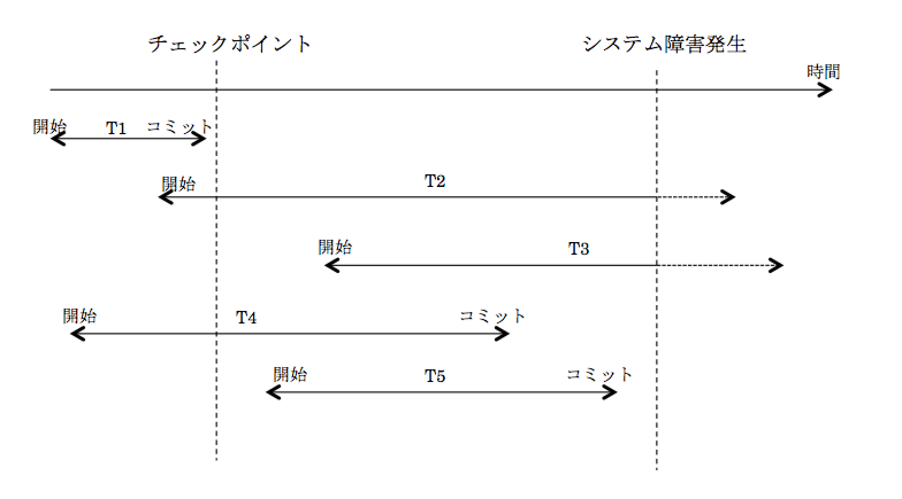
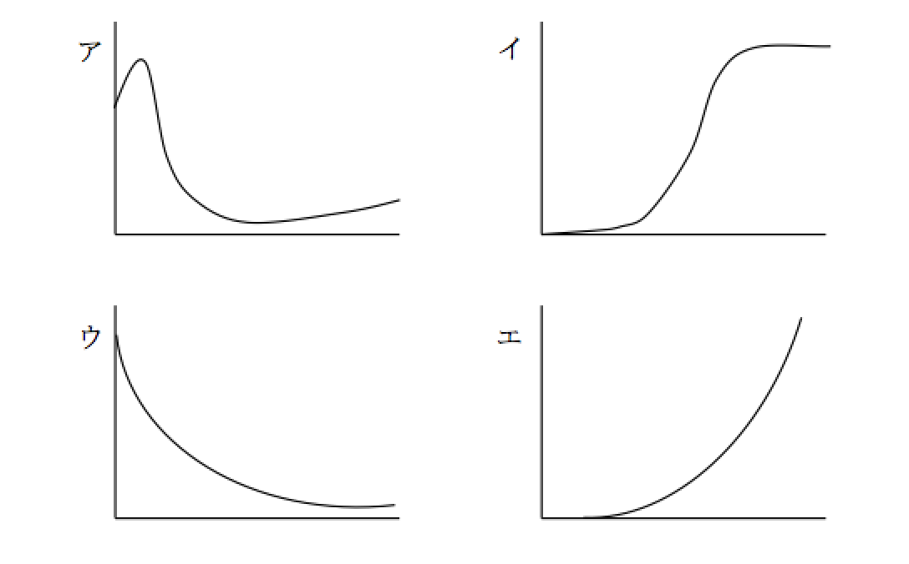

# line-challenge-A1

### 問1.次の条件a～dを満たすデータを処理するために、内部データ構造の要素①～③を考えた。これらを用いて実装できるデータ構造は、どの抽象データ型に分類されるか。
- [ ] ア　キュー（FIFO）
- [ ] イ　スタック(LIFO)
- [ ] ウ　根付き木
- [ ] エ　優先度キュー

#### [条件]	
- a データはすべて同じ型をもつ。
- b データは時系列的に発生する。
- c 処理の済んだデータを記憶しておく必要はない。
- d 未処理のデータ数は常にn未満になることが分かっている。

#### [内部データ構造の要素]
- ①	データと同じ型の要素をもつ大きさnの配列Ａ（Ａ[0], Ａ[1],・・・, Ａ[n-1]）
- ②	0以上n未満の整数が記憶できる変数ＸとＹ
- ③	0以上n未満の値をとる仮引数iに対して、i+1をnで割った余りを返す関数succ(i)


### 問2.	葉以外の節点はすべて二つの子をもち、根から葉までの深さがすべて等しい木を考える。この木に関する記述のうち、適切なものはどれか。ここで、深さとは根から葉に至るまでの辺の数を表す。

- [ ] ア　木の深さがnならば、葉の数は2ｎ-1である。
- [ ] イ　節点の数がnならば、深さはlog2nである。
- [ ] ウ　葉の数がnならば、葉以外の節点の数はn-1である。
- [ ] エ　辺の数がnならば、節点の数もnである。

### 問3.	相異なるn個のデータが昇順に整列された表がある。この表をm個ごとのブロックに分割し、各ブロックの最後尾のデータだけを線形探索することによって、目的のデータの存在するブロックを探し出す。次に、当該ブロック内を線形探索して目的のデータを探し出す。このときの平均探索回数はどれか。ここでm<nとし、目的のデータは必ず表の中に存在するものとする。

- [ ] ア　n/m
- [ ] イ　n/2m
- [ ] ウ　m + n/m
- [ ] エ　m/2　+ n/2m　


### 問4.	ヒープソートの説明として、適切なものはどれか。
- [ ] ア　ある間隔おきに取り出した要素から成る部分列をそれぞれ整列し、更に間隔を詰めて同様の操作を行い、間隔が1になるまでこれを繰り返す。
- [ ] イ　中間的な基準値を決めて、それよりも大きな値を集めた区分と、小さな値を集めた区分に要素を振り分ける。次に、それぞれの区分の中で同様な処理を繰り返す。
- [ ] ウ　隣り合う要素を比較して、大小の順が逆であれば、それらの要素を入れ替えるという操作を繰り返す。
- [ ] エ　未整列の部分を順序木にし、そこから最小値を取り出して整列済みの部分に移す。この操作を繰り返して、未整列の部分を縮めていく。


### 問5.非負の整数xに対して、次のとおりに定義された手続F（x）がある。F(10)で印刷される結果はどれか。ここで、p  div q はp をqで割った商の整数部分、p  mod qはp をqで割った剰余、print(p)はpの値を印刷することを表す。印刷は、左から右に行う。

```
F(ｘ)｛
　if(x>0){
F（x div 8）;
   print（x mod 8）;
  }
}
```

- [ ] ア　012
- [ ] イ　10
- [ ] ウ　12
- [ ] エ　21


### 問6.Javaサーブレットの説明はどれか。

- [ ] ア　HTML文書に記述されたスクリプトを実行するWebコンポ―ネントである。
- [ ] イ　JavaでCGIを開発するための機能である。
- [ ] ウ　一度ロードされるとサーバに常駐し、スレッドとして実行されるWebコンポーネントである。
- [ ] エ　分散オブジェクト技術を用いたソフトウェア部品が開発できるプラットフォームである。

### 問7.空の状態のキューとスタックの二つのデータ構造がある。次の手続を順に実行した場合、変数xに代入されるデータはどれか。ここで、
- データyをスタックに挿入することをpush(y)、
- スタックからデータを取り出すことをpop( )、
- データyをキューに挿入することをenq(y)、
- キューからデータを取り出すことをdeq( )、

とそれぞれ表す。
```
 push(a)
 push(b)
 enq(pop( ))
 enq(c)
 push(d)
 push(deq( ))
 x←pop( )
```
- [ ] ア　a
- [ ] イ　b
- [ ] ウ　c
- [ ] エ　d


### 問8.次のような双方向のポインタをもつリスト構造のデータがある。社員Gを社員Aと社員Kの間に追加する場合、追加後の表のポインタa～fのうち、追加前と比べて値が変わるのは何か所か。

追加前

|アドレス|社員名|次ポインタ|前ポインタ|
|---|---|---|---|
|100|社員A|300|0|
|200|社員T|0|300|
|300|社員K|200|100|

追加後

|アドレス|社員名|次ポインタ|前ポインタ|
|---|---|---|---|
|100|社員A|a|b|
|200|社員T|c|d|
|300|社員K|e|f|
|400|社員G|x|y|

- [ ] ア　1
- [ ] イ　2
- [ ] ウ　3
- [ ] エ　4

### 問9.データ構造の一つである木構造に関する記述として、適切なものはどれか。
- [ ]	ア　階層の上位から下位に節点をたどることによって、データを取り出すことができる構造である。
- [ ]	イ　格納した順序でデータを取り出す事ができる構造である。
- [ ]	ウ　格納した順序とは逆の順序でデータを取り出すことができる構造である。
- [ ]	エ　データ部と一つのポインタ部で構成されるセルをたどることによって、データを取り出すことができる構造である。

### 問10.昇順に整列されたn個のデータが配列に格納されている。探索したい値を2分探索法で探索する時の、およその比較回数を求める式はどれか。

- [ ] ア　log2n
- [ ] イ　(log2n + 1) / 2 
- [ ] ウ　n
- [ ] エ　n2

### 問11.四つの数の並び(4、1、3、2)を、ある整列アルゴリズムに従って昇順に並べ替えたところ、数の入替えは次のとおり行われた。この整列アルゴリズムはどれか。
```
(１、４、３、２)
(１、３、４、２)
(１、２、３、４)
```
- [ ] ア　クイックソート
- [ ] イ　選択ソート
- [ ] ウ　挿入ソート
- [ ] エ　バブルソート


### 問12.クライアントサーバシステムの3層アーキテクチャを説明したものはどれか。
- [ ]	ア　アプリケーションに必要なＧＵＩをＡＰＩをプレゼンテーション層とファンクション層に分離したアーキテクチャで、データベースサーバが独立している。
- [ ]	イ　プレゼンテーション層、ファンクション層、データ層に分離したアーキテクチャで、各層のＯＳは異なってもよい。
- [ ]	ウ　プレゼンテーション層とデータ層をミドルウェア層によって連係したアーキテクチャで、各層をネットワークで接続されたコンピュータに分散する。
- [ ]	エ　プレゼンテーション層とファンクション層を結合し、データ層を分離したアーキテクチャで、データベースサーバを効率的に運用できる。

### 問13.フェールソフトの説明として、適切なものはどれか。
- [ ]	ア　システムの一部に障害が発生したとき、それ以外の部分の機能でシステムの運転を継続する。
- [ ]	イ　システムの一部に障害が発生したとき、致命的影響を与えないよう、システムをあらかじめ定めた安全な状態に移行する。
- [ ]	ウ　信頼度の高い部品を使用したり、バグの少ないソフトウェアを開発したりして、信頼性の高いシステムを構築する。
- [ ]	エ　特定の時点でデータベースのバックアップを取り、障害が発生した場合には、バックアップを取った時点の状態まで戻して運転を継続する。

### 問14.ページング方式の仮想記憶において、ページ置換えの発生頻度が高くなり、システムの処理能力が急激に低下することがある。このような現象を何と呼ぶか。

- [ ] ア　スラッシング
- [ ] イ　スワップアウト
- [ ] ウ　フラグメンテーション
- [ ] エ　ページフォールト

### 問15.インターネットで用いられるMIMEの説明として、適切なものはどれか。
- [ ]	ア　Web上でのハイパテキストの記述言語である。
- [ ]	イ　インターネット上のクライアントとサーバとの間のデータ転送プロトコルである。
- [ ]	ウ　インターネット上の資源を一意に識別するアドレス記述方式である。
- [ ]	エ　電子メールで音声や画像などのマルチメディア情報を取り扱えるようにする規格である。


### 問16.図は、組織内のTCP/IPネットワークにあるクライアントが、プロキシサーバ、ルータ、インターネットを経由して組織外のWebサーバを利用するときの経路を示している。この通信のTCPコネクションが設定される場所はどれか。

- [ ]	ア　クライアントとWebサーバの間、クライアントとプロキシサーバの間
- [ ]	イ　クライアントとプロキシサーバの間、プロキシサーバとWebサーバの間
- [ ]	ウ　クライアントとプロキシサーバの間、プロキシサーバとルータの間、ルータとWebサーバの間
- [ ]	エ　クライアントとルータの間、ルータとWebサーバの間

### 問17.	公開鍵基盤とハッシュ関数を利用したメッセージ認証の手法はどれか。
- [ ]	ア　受信者は、送信者の公開鍵とハッシュ関数を用いてハッシュ値を復号し、メッセージを得る。
- [ ]	イ　受信者は、ハッシュ関数を用いてメッセージからハッシュ値を生成し、送信者の公開鍵で復号したハッシュ値と比較する。
- [ ]	ウ　送信者は、自分の公開鍵とハッシュ関数を用いてメッセージからハッシュ値を生成し、メッセージとともに送信する。
- [ ]	エ　送信者は、ハッシュ関数を用いて送信者の秘密鍵のハッシュ値を生成し、メッセージとともに送信する。

### 問18.	情報システムのリスク分析における作業①～⑤の、適切な順序はどれか。

①	損失の分類と影響度の評価
②	対策の検討・評価と優先順位の決定
③	事故態様の関連分析と損失額予想
④	脆弱性の発見と識別
⑤	分析対象の理解と分析計画

- [ ] ア　　④→⑤→②→③→①
- [ ] イ　　④→⑤→③→②→①
- [ ] ウ　　⑤→④→②→③→①
- [ ] エ　　⑤→④→③→①→②

### 問19.	3層クライアントサーバシステムのファンクション層で処理される二つの機能の組み合わせはどれか。

- [ ]	ア　検索条件の入力、データ処理条件の組み立て
- [ ]	イ　検索条件の入力、データへのアクセス
- [ ]	ウ　データ処理条件の組み立て、データの加工
- [ ]	エ　データへのアクセス、データの加工

### 問20.	仮想記憶機能をもつパソコンで表計算ソフトを使用中にワープロソフトを起動しようとしたところ、メモリ不足が原因で起動できなかった。根本的な解決策はメモリ増設であるが、それまでの対応として、有効な手段はどれか。
- [ ]	ア　仮想記憶の大きさの設定値を増やす。
- [ ]	イ　磁気ディスク上の不要なファイルを消去する。
- [ ]	ウ　接続してある周辺装置を外す。
- [ ]	エ　ワークシート中の未使用の列は、表示しないようにする。

### 問21.	IPアドレス10.1.2.146、サブネットマスク255.255.255.240のホストが属するサブネットワークはどれか。
- [ ] ア　10.1.2.132/26	
- [ ] イ　10.1.2.132/28
- [ ] ウ　10.1.2.144/26
- [ ] エ　10.1.2.144/28

### 問22.	OSI基本参照モデルにおけるネットワーク層の説明として、適切なものはどれか。
- [ ]	ア　エンドシステム間のデータ伝送を実現するために、ルーティングや中継などを行う。
- [ ]	イ　各層のうち、もっとも利用者に近い部分であり、ファイル転送や電子メールなどの機能が実現されている。
- [ ]	ウ　物理的な通信媒体の特性の差を吸収し、上位の層に透過的な伝送路を提供する。
- [ ]	エ　隣接ノード間の電装制御手順（誤り検出、再送制御など）を提供する。

### 問23.	公開鍵暗号方式の用法に関する記述のうち、送信者が間違いなく本人であることを受信者が確認できるのはどれか。

- [ ]	ア　送信者は自分の公開鍵で暗号化し、受信者は自分の秘密鍵で復号する。
- [ ]	イ　送信者は自分の秘密鍵で暗号化し、受信者は送信者の公開鍵で復号する。
- [ ]	ウ　送信者は受信者の公開鍵で暗号化し、受信者は自分の秘密鍵で復号する。
- [ ]	エ　送信者は受信者の秘密鍵で暗号化し、受信者は自分の公開鍵で復号する。

### 問24.	チェックポイントを取得するDBMSにおいて、図のような時間経過でシステム障害が発生した。前進復帰（ロールフォワード）によって障害回復できるすべてのトランザクションはどれか。



- [ ] ア　T1
- [ ] イ　T2とT3
- [ ] ウ  T4とT5
- [ ] エ　T5

### 問25.	元のデータベースと同じ内容の複製データベースをあらかじめ用意しておき、元のデータベースが更新されると、独立のプロセスが、指定された一定時間後にその内容を複製データベースに反映する手法はどれか。
- [ ] ア　2相コミットメント
- [ ] イ　イメージコピー
- [ ] ウ　ミラーリング
- [ ] エ　レプリケーション

### 問26.	DBMSにおけるログファイルの説明として、適切なものはどれか。

- [ ]	ア　システムダウンが発生したときにデータベースの回復処理時間を短縮するため、メモリ上の更新データを定期的にディスクに書きだしたものである。
- [ ]	イ　ディスク障害があってもシステムをすぐに実行させるため、常に同一データのコピーを別ディスクや別サイトのデータベースに書きだしたものである。
- [ ]	ウ　ディスク障害からデータベースを回復するため、データベースの内容をディスク単位で複写したものである。
- [ ]	エ　データベースの回復処理のため、データの更新前後の値を書きだしてデータベースの更新記録を取ったもの
である。

### 問27.	E-R図に関する記述として、適切なものはどれか。

- [ ]	ア　関係データベースへの実装を前提に作成する。
- [ ]	イ　業務上の各プロセスとデータの関係を明らかにする。結果として導かれる実体間の関連は、業務上の各プロセスを表現する。
- [ ]	ウ　業務で扱う情報を抽象化し、実体及び実体間の関連を表現する。
- [ ]	エ　データの精製から消滅に至るプロセスを表現できる。

### 問28.	“商品”表のデータが次の状態のとき、〔ビュー定義〕で示すビュー“収益商品”表に現れる行数が減少する更新処理はどれか。


``` 
	〔ビュー定義〕
	　CREATE VIEW 収益商品
	　　　　　AS SELECT  *  FROM　商品
		WHERE　売値　–　仕入値　>=　40000
```
- [ ]	ア　型式がR2003の売値を130,000に更新する。
- [ ]	イ　型式がR2003の仕入値を90,000に更新する。
- [ ]	ウ　型式がS2003の仕入値を150,000に更新する。
- [ ]	エ　型式がT2003の売値を130,000に更新する。

### 問29.	データベースの回復処理に関する記述として、適切なものはどれか。
- [ ]	ア　ウォームスタート方式の再始動では、チェックポイントまで戻り、更新情報のログを使用してデータベースを回復する。
- [ ]	イ　更新情報のログを見て、チェックポイントから後に正常終了したトランザクションの情報をデータベースに反映する操作を、ロールバックという。
- [ ]	ウ　コールドスタート方式の再始動では、チェックポイントでのログと更新情報のログが使用される。
- [ ]	エ　障害発生時に終了していないトランザクションを更新前の状態に戻す操作をロールフォワードという。

### 問30.	ラウンドロビン方式のタスクスケジューリングの説明として、適切なものはどれか。
- [ ]	ア　一定時間ごとにタイマ割込みを発生させ、実行可能の待ち行列の先頭タスクにＣＰＵ資源を割り当てる。
- [ ]	イ　各タスクの優先順位に従ってＣＰＵ資源を割り当てる。
- [ ]	ウ　処理時間の短いタスクから順にＣＰＵ資源を割り当てる。
- [ ]	エ　何らかの割込みが発生したときに、直ちに起動する必要のあるタスクにＣＰＵ資源を割り当てる。

### 問31.	ソフトウェア開発・保守工程において、リポジトリを構築する理由はどれか。
- [ ]	ア　各工程での作業手順を定義することが容易になり、開発・保守時の作業ミスを防止することができる。
- [ ]	イ　各工程での作業予定と実績を関連付けて管理することが可能になり、作業の進捗管理が容易になる。
- [ ]	ウ　各工程での成果物を一元管理することによって、用語を統一することもでき、開発・保守作業の効率が良くなる。
- [ ]	エ　各工程での発生不良を管理することが可能になり、ソフトウェアの品質分析が容易になる。

### 問32.	OSS（Open Source Software）の特徴のうち、適切なものはどれか。ただし、OSSはOSI（Open Source Initiative）によるOSD（The Open Source Definition）の定義に基づくものとする。

- [ ]	ア　OSSはフリーウェアと同様に無償で入手できるが、商用システムの開発への利用は禁止されている。
- [ ]	イ　OSSをパッケージ化したり、自社のソフトウェアを組み合わせたりして、有償で販売することができる。
- [ ] ウ　システム開発で利用できるようにソースコードで入手できるが、利用者がある数以上になるとライセンス料が発生する。
- [ ]	エ　複製と改良は自由にできるが、改良したソフトウェアを再頒布することはできない。

### 問33.	モジュールの独立性を高めるには、モジュール結合度を弱くする必要がある。モジュール間の情報の受渡し方法のうち、モジュール結合度が最も弱いものはどれか。

- [ ]	ア　共通域に定義したデータを、関係するモジュールが参照する。
- [ ]	イ　制御パラメタを引数として渡し、モジュールの実行順序を制御する。
- [ ]	ウ　データ項目だけをモジュール間の引数として渡す。
- [ ]	エ　必要なデータだけを外部宣言して共有する。

### 問34.	ａ～ｃの説明とレビューとの対応について、適切な組み合わせはどれか。

- ａ　参加者全員が持ち回りでレビュー責任者を務めながらレビューを行うので、参加者全員の参画意欲が高まる。
- ｂ　レビュー対象物の作成者が説明者になり、入力データの値を仮定して、手続きをステップごとに机上でシミュレーションしながらレビューを行う。
- ｃ　あらかじめ参加者の役割を決めておくとともに、進行役の議長を固定し、レビューの焦点を絞って迅速にレビュー対象を評価する。

||a|b|c|
|---|---|---|---|
|ア|インスペクション|ウォークスルー|ラウンドロビン|
|イ|ウォークスルー|インスペクション|ラウンドロビン|
|ウ|ラウンドロビン|インスペクション|ウォークスルー|
|エ|ラウンドロビン|ウォークスルー|インスペクション|

### 問35.	図はマルチタスクで動作するコンピュータにおけるタスクの状態遷移を表したものである。実行状態のタスクが実行可能状態に遷移するのはどれか。



- [ ]	ア　自分より優先度の高いタスクが実行可能状態になった。
- [ ]	イ　タスクが生成された。
- [ ]	ウ　入出力要求による処理が完了した。
- [ ]	エ　入出力要求を行った。

### 問36.	OSIによるオープンソースソフトウェアの定義に従うとき、適切なものはどれか。
- [ ]	ア　ある特定の業界向けに作成されたオープンソースソフトウェアは、ソースコードを公開する範囲をその業界に限定することができる。
- [ ]	イ　オープンソースソフトウェアを改変し再配布する場合、元のソフトウェアと同じ配布条件となるように、同じライセンスを適用して配布する必要がある。
- [ ]	ウ　オープンソースソフトウェアを第三者が製品として再配布する場合、そのオープンソースソフトウェアの開発者は第三者に対してライセンス費を請求することができる。
- [ ]	エ　社内での利用などのようにオープンソースソフトウェアを改変しても再配布しない場合、改変部分のソースコードを公開しなくてもよい。

### 問37.	モジュールの変更による影響を少なくするためには、モジュール間の関連性をできるだけ少なくして独立性を高くすることが重要である。モジュールの独立性が最も高いものはどれか。

- [ ]	ア 関係するモジュールが共有域に定義したデータを参照する。
- [ ]	イ 制御要素を引数として渡し、そのモジュールの実行を制御する。
- [ ]	ウ 必要なデータだけを外部宣言して共有する。
- [ ]	エ モジュール間の引数として単一のデータ項目を渡す。

### 問38.	ソフトウェア開発における仕様のレビューに関する記述として、適切なものはどれか。
- [ ]	ア　外部仕様と内部仕様とは、独立した関係が望ましく、相互依存するほどレビューによる不良発見が難しくなる。
- [ ]	イ　外部仕様のレビューでは、ユーザ要件や実現可能性を確認し、内部仕様のレビューでは、外部仕様との不整合や内部仕様書内の矛盾を発見する。
- [ ]	ウ　ソフトウェアのエラー数は、外部仕様のレビューによって発見されたエラー数と、内部仕様のレビューによって発見されたエラー数の和である。
- [ ]	エ　内部仕様のレビューは、プログラムの制御構造、モジュール問の制御構造、帳票・画面の様式について実施する。

### 問39.表は、あるプログラムの入カデータを、有効同値クラスと無効同値クラスに分けたものである。同値分割法によってテストケースを設計する場合、最小限のテストデータの組合せとして、適切なものはどれか。

|同地クラス|データ|
|---|---|
|無効同値クラス|-2,-1,0|
|有効同値クラス|1,2,3,4,5|
|無効同値クラス|6,7,8|

- [ ] ア　-2, 0, 1, 5, 6, 8
- [ ] イ　0, 1, 5, 6
- [ ] ウ　-1, 3, 6
- [ ] エ　1, 5

### 問40.	ソフトウェア開発のプロセスモデルのうち、開発サイクルごとにリスクを最小にしながら、開発サイクルを繰り返すことによって、システムの完成度を高めていくプロセスモデルはどれか。
- [ ]	ア　ウォータフォールモデル
- [ ] イ　スパイラルモデル
- [ ]	ウ　成長モデル 
- [ ] エ　プロトタイピングモデル

### 問41.	JavaScriptの非同期通信の機能を使うことによって、画面遷移が起らない動的なユーザインタフェースを実現する技術はどれか。
- [ ] ア　Ajax
- [ ] イ　JSF
- [ ] ウ　RSS
- [ ] エ　SNS

### 問42.	自社で開発した大規模なアプリケーションソフトウェアの保守費用の推移を表したグラフとして、適切なものはどれか。
ここで、グラフの横軸は使用開始から使用停止までの経過時間、縦軸は単位期間あたりの保守費用とする。

- [ ] ア　グラフ1
- [ ] イ　グラフ2
- [ ] ウ　グラフ3
- [ ] エ　グラフ4

### 問43.	システム障害への対策に関する記述のうち、適切なものはどれか。

- [ ]	ア　システム障害時に、プログラムやデータのエラーの原因がすぐに分かれば、オペレータ自身が自ら修正して早期回復に当たるのが望ましい。
- [ ]	イ　システム障害時には、まず回復処理を優先し、その後情報システム部門へ報告するという順序で行うのが望ましい。
- [ ]	ウ　システム障害によってトランザクション処理が中断した場合、再試行をしてシステムを早期に回復させる。
- [ ] エ　システム障害から効率よく回復するために、日常からオペレーション実施記録を残して異常が起きていない期間を明らかにしておく。

### 問44.	電機メーカのＡ社は、ＧＰＬが適用されたオープンソースソフトウェアの一部を改変した二次的著作物を搭載してテレビの新製品を開発した。この製品を販売するに当たり、Ａ社が求められるＧＰＬのルールに則した適切な対応はどれか。

- [ ]	ア　請求があればＡ社が修正した部分を含むすべての二次的著作物のソースコードを公開しなければならない。
- [ ]	イ　二次的著作物に静的にリンクしている、別のアプリケーションのソースコードは公開しなくてもよい。
- [ ]	ウ　二次的著作物のソースコードを公開する際には、諸費用などの対価を請求してはならない。
- [ ]	エ　二次的著作物を入手した購入者が、その複製を再配布することを禁止しなければならない。

### 問45.	Ｗｅｂページの著作権に関する記述のうち、適切なものはどれか。
- [ ]	ア　　営利目的ではなく趣味として、個人が開設しているＷｅｂページに他人の著作物を無断掲載しても、私的使用であるから、著作権の侵害とはならない。
- [ ]	イ　　作成したプログラムをインターネット上でフリーウェアとして公開した場合、配布されたプログラムは、著作権法による保護の対象とはならない。
- [ ]	ウ　　試用期間中のシェアウェアを使用して作成したデータを、試用期間終了後もＷｅｂページに掲載することは、著作権の侵害に当たる。
- [ ]	エ　　特定の分野ごとにＷｅｂページのＵＲＬを収集し、簡単なコメントをつけたリンク集は、著作権法で保護される。

### 問46.	次の画像符号化方式のうち、携帯電話などの低速回線用の動画像の符号化に用いられるものはどれか。
- [ ] ア　JPEG
- [ ] イ　MPEG-1
- [ ] ウ　MPEG-2
- [ ] エ　MPEG-4

### 問47.	アプリケーションの保守に関する記述として、適切なものはどれか。

- [ ]	ア　テスト終了後は速やかに本稼働中のライブラリにプログラムを登録し、保守承認者に報告する。
- [ ]	イ　変更内容が簡単であると判断できるときは、本稼働用のライブラリを直接更新する。
- [ ]	ウ　保守作業が完了しないまま放置されるのを防ぐためにも、保守の完了を記録する。
- [ ]	エ　保守作業は、保守作業担当者によるテストが終了した時点で完了とする。

### 問48.	EC (Electronic commerce)に関する説明として、適切なものはどれか。
- [ ]	ア　営業活動にITを活用して営業効率と品質を高め、売上・利益の大幅な増加や、顧客満足度の向上を目指す方法である。
- [ ]	イ　企業がもつ経営資源全体を、総合的かつ一元的に計画・管理し、経営の効率化を図る手法・概念である。
- [ ]	ウ　小売店の売上と利益を伸ばすことによって、卸売業者・メーカが自社との取引拡大につなげるための小売店の経営活動を支援するシステムである。
- [ ]	エ　消費者向けや企業間の商取引を、インターネットなどの電子的なネットワークを活用して行うことである。

### 問49.	著作権法において、保護の対象とならないものはどれか。
- [ ]	ア　インターネットで公開されたフリーソフトウェア
- [ ]	イ　ソフトウェアの操作マニュアル
- [ ]	ウ　データベース
- [ ]	エ　プログラム言語や規約

### 問50.	“コンピュータ不正アクセス対策基準”に適合しているものはどれか。
- [ ]	ア　監視効率を向上させるためにすべてのネットワークを相互接続する。
- [ ]	イ　業務上必要な場合は、利用者IDを個人間で共有して使用できる。
- [ ]	ウ　システム管理者が、すべての権限を持つ利用者IDを常に使用できる。
- [ ]	エ　組織のセキュリティ方針を文書化し、定期的に研修を開催する。

### 問51.	UCS-2 (unicode)を説明したものはどれか。
- [ ]	ア　JISから派生したコード体系であり、英数字は1バイト、漢字は2バイトで表現する。
- [ ]	イ　主にUNⅨで使用するコード体系であり、英数字は1バイト、漢字は2バイトで表現する。
- [ ]	ウ　すべての文字を1バイトで表現するコード体系である。
- [ ]	エ　すべての文字を2バイトで表現するコード体系であり、多くの国の文字体系に対応できる。